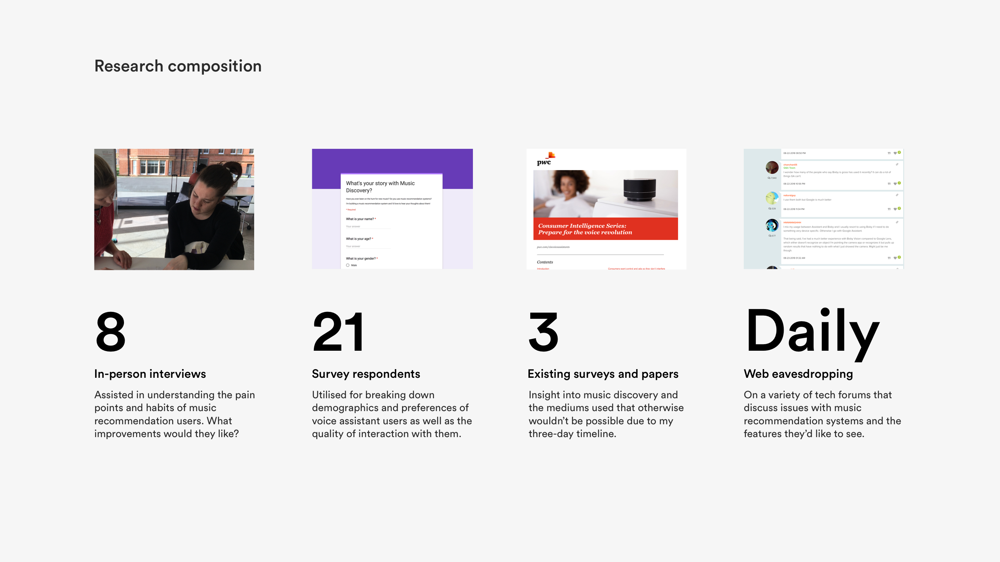
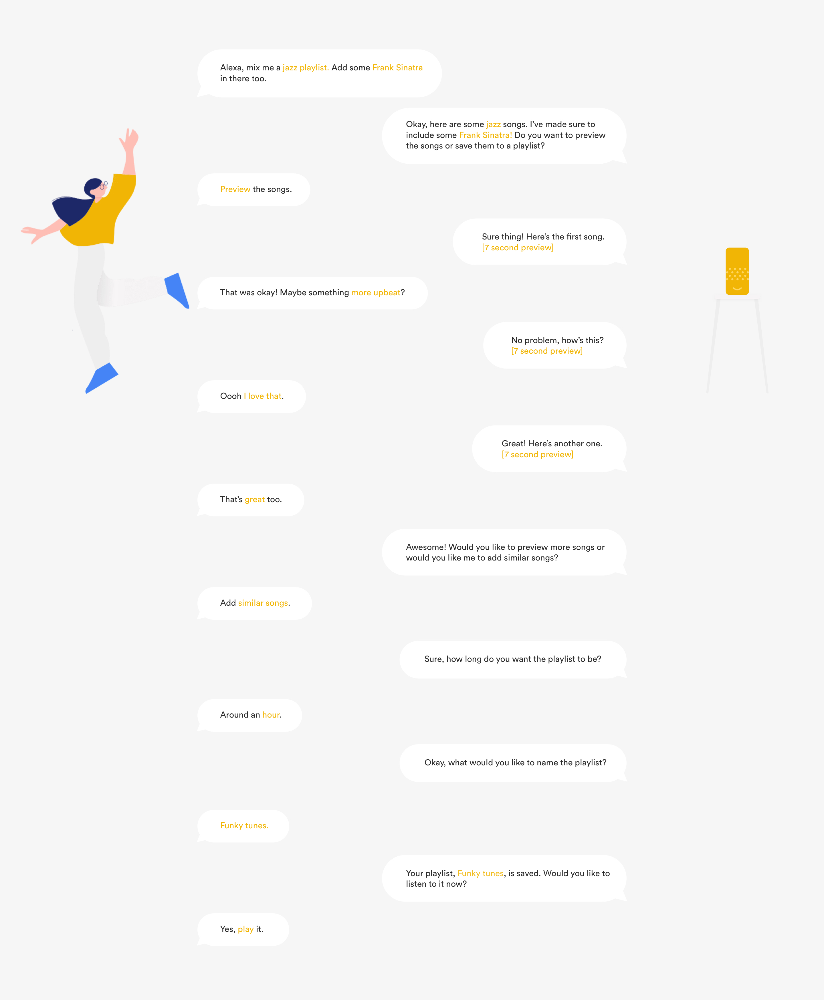
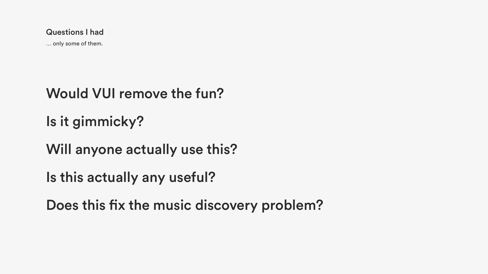
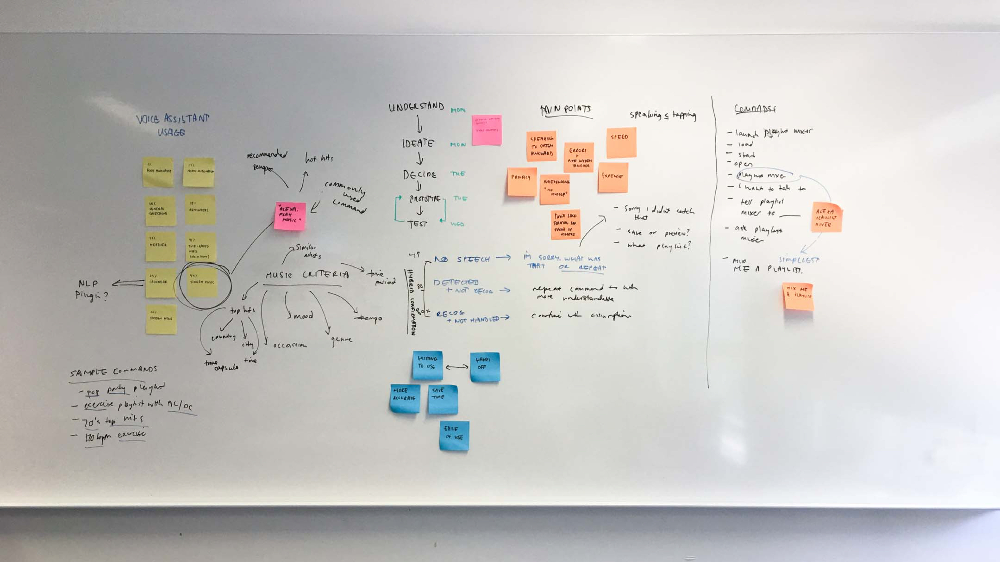
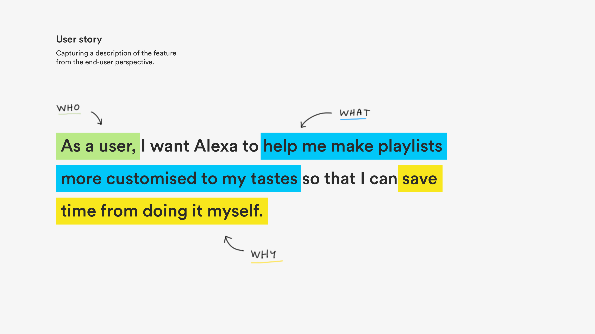
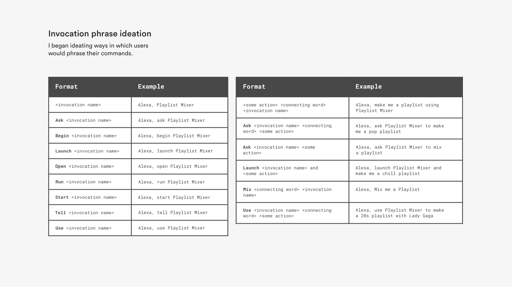
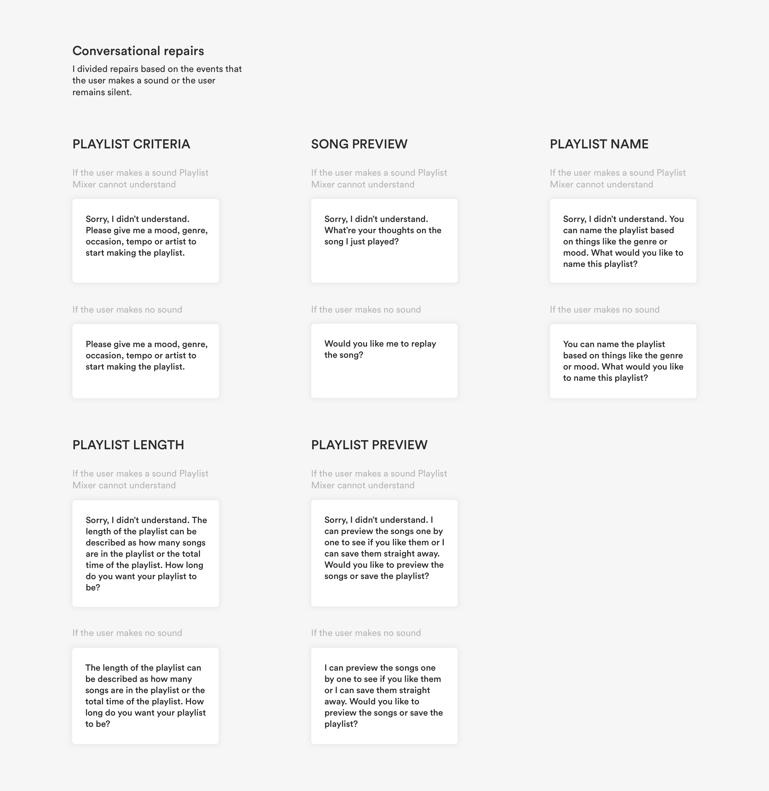
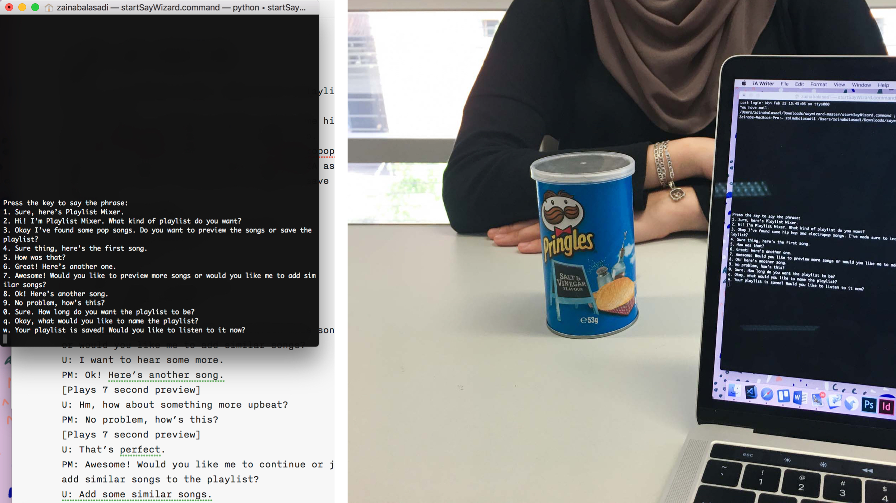
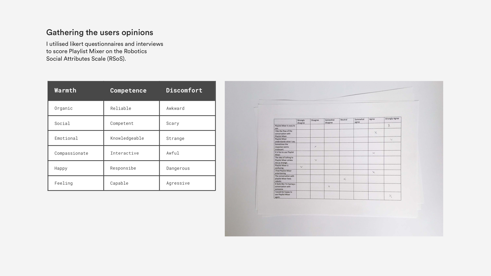

## Question
How might we make new music discovery effortless?

## The problem with music discovery
There exists many music streaming services that offer millions of songs for listening. Many of these services also provide a feature whereby they recommend music that they believe a listener might like. However, very few of these services make music discovery easy and exciting. These features are often buried within the product, waiting to be found by the listeners who are most eager to hunt for new tunes. Once they’re found, they’re often difficult to navigate and cognitively exhausting.

> Right now, music discovery largely comes down to your willingness to exert the effort necessary to find new good things — Louie Herr from Digital Trends.
{: {{site.site-case-quote}}}

Music recommendation solutions available on the market today haven’t solved the issue of easy and enjoyable music discovery. The solutions are inconvenient, inefficient and unrewarding.

## Understanding the issue
Music discovery has always been an issue of mine. Should I invest the time to go down the rabbit-hole that is the Spotify recommended playlist or should I just shuffle an old playlist of mine? From someone who used to count down the days till Monday where my beloved Spotify recommendations for the week were released, I barely give the playlist a second thought, scrolling past it with a shudder. It wasn’t always like this. I wanted to learn more about why this was happening. Were others experiencing the same problem?

## The initial research
Delving deeper into the pain points surrounding music discovery,  I undertook my own surveys and interviews and extracted data from existing surveys on music recommendation.

### The findings 
{: {{site.site-text-overline1}}}

### Overwhelming
The biggest problem with music discoverability wasn’t actually discoverability. 

The most prominent opinion that participants had were that music recommendation playlist are overwhelmingly long. A sheer 84% agreed that they were overwhelmed by the number of music choices they had, whether good or bad. The result of these recommended song playlists are essentially someone spouting off a thousand really good recommendations in a five-minute span, which is just as ineffective as if a friend who gives you a single bad recommendation. 

> Scrolling through recommended song playlist feels like watching movie credits — an interviewee's response.
{: {{site.site-case-quote}}}

### Valuing the journey, not the destination
Only 11% of participants said they weren’t happy with the music that was recommended to them but 46% still seek out music themselves, 26% primarily find music through algorithm-based recommendations and 16% prefer suggestions to come from friends or social media influencers.

Whilst recommended music playlists do a decent job of recommending music that a user might like, many aren’t ready to leave it at that. Rather, listeners want to actively take part in finding new music and enjoy the journey of finding their next favourite song as much as the final destination. The algorithmic-driven recommendations strips the added excitement and emotional investment which is inherently part of discovery.

### What you listen to is what you get
Whilst its often assumed that listeners are content with listening to one or two particular genres of music, this isn’t always the case. Approximately 59% struggle to find music outside of their own ‘musical bubble’ due to the narrow-minded nature of recommended music playlists, basing recommendations on previous streamings although the sweet satisfaction of a new favourite song heavily outweighs the time it might take to flip through a range of artists you’ve never encountered before.

## The goals
Through extensive primary and secondary research, from observation, interviews, surveys, and more, I was able to distill a core set of user needs for the product solution.

- Take a chunk of the user effort required out find new music
- Be able to customise recommendations in real time
- Give users the sense of credit for every discovery they make
- Provide users with options to further research a song or artist

## Introducing Mixer
Humanised through Amazon’s Alexa, Playlist Mixer is an Amazon skill that understands a your musical preferences and works with you—and not for you—to choose songs and create playlists.

Instead of simply feeding data into an algorithm that delivers music suggestions, Playlist Mixer involves the user in the music discovery process and creating a more meaningful interaction. This in-turn creates a sense of connection to the artists and the music, stemming directly from the experience of exploring and finding them. 

> The discovery is special, because they made it happen.
{: {{site.site-case-quote}}}

Basing the recommended music off the users previous music streamings, Playlist Mixer has the ability to further customise recommendations based on mood, genre, tempo and artist.

Playlist Mixer works like this:

## The design process
Initially brainstorming was based around deciding what medium to pursue for the product solution. It was clear that listeners still craved that sense of being the driver of the discovery so it was essential that my solution didn’t muddle that. 

Listeners didn’t like the algorithm that simply spit recommendations to them. Early explorations such as shorter recommended playlists, single recommendations and even a Tinder-eqsue swipe system still left listeners feeling like a witness of the discovery rather than the archeologist themselves.

Rather than an algorithm hiding behind UI elements and popping up in timed increments, what if the algorithm hid behind a voice? 

And so, the dots connection and the Playlist Mixer concept was born but it was the question if VUI was an appropriate medium for this problem space.

   
   
Only some of the questions I had.

   
   
Delving into how VUI music recommender could work.

Like any technology going mainstream, I was cautious to jump on the VUI bandwagon as I wasn’t quite sure if it would be the correct medium for the problem. 
 
Adapted from Yogesh Moorjani’s article on chatbot design, I asked myself 5 questions:

1. What is the outcome I want for users of my product/service?
2. What is the business outcome I want to drive?
3. Why would VUI be the best medium for this outcome?
4. Does this idea replace tasks that people love doing?
5. Is the cost for using this product/service less than the perceived value?

Asking these questions helped determine if VUI characteristics would help with use cases that were otherwise difficult to solve with a traditional UI.

Users disliked manual music discovery because of the time and effort needed to invest into it. Alexa and Amazon Music could do the music discovery for the user. Manual music discovery is timely. Alexa and Amazon Music can find songs a user like in milliseconds. Not to mention that it would be more accurate and much more enjoyable.

All systems were go.

## Design
Borrowing from agile software methodologies, I began the wireframing process by defining a set of user stories for the Mixer. User stories represented the major scenarios; the purpose of the voice assistant and the way the user can interact with the voice assistant in short succinct sentences.

It was essential that Playlist Mixer didn’t just recommend music based on previous listening history, but rather, also on inputs such as mood, tempo, occasion and artist.

Next, I began ideating the keywords that could invoke the interaction. This was particularly difficult as the inbuilt Alexa phrase “Alexa, make me a playlist” or “Alexa, play me some songs” were already being used to carry out other commands.

I settled on referring to Playlist Mixer as a separate entity and set the invocation name as "Playlist Mixer". Whenever Alexa would hear "Playlist Mixer", it knew what to do, no matter how the user phrased the command.

This resulted in a clearer division between the inbuilt empty playlist command and Playlist Mixer. In turn, I hypothesised that this would reduce the amount of errors.

With the invocation name set and a list of the possible utterances (defined as whatever users say), I began crafting a few sample dialogues for the user stories.

Unlike traditional UI where users can scroll through a list of songs to select a song, I didn’t have the luxury of playing users a consecutive list of songs and asking them to make a choice. Alexa could only provide one song at a time in order to reduce the cognitive and load and friction that is naturally found in VUI.

I then went on to writing repairs or errors for the conversation. Since there isn’t a clear signal of intent (like the signal of a button click in traditional UI), it was up to me to anticipate the users intent at each point in the conversation and shape an appropriate error response and recovery strategy.

I went with two-tiered confidence for the Playlist Mixer in order to deliver the appropriate conversational repair to the circumstance. These tiers were:

- No speech was detected
- Speech was detected but not understood

## Testing the concept
After creating a basic wireframe of the conversation, I took to testing. Wizard of Oz (WoZ) testing was the best testing method for this scenario. Often used for VUI, it is where humans interact with a system that seems real, when in reality, it’s controlled by someone behind the scenes.

I conducted WoZ testing with 8 participants in order to get a rough idea of the types of responses that worked and didn’t. I not only noted how users interacted with Playlist Mixer and the utterances they used, but I also noted their facial expressions and body language. **Did they frown at a particular answer? Did they laugh at a response? Did they barge-in while Mixer was speaking?**

   
   
The testing environment: command line Alexa emulator and Mr Pringle, the stand in for Alexa.

Following the WoZ testing, I gave participants a satisfaction questionnaire to complete and a couple of interview questions. This was my opportunity to know about the performance of Mixer through the participants eyes and ensure that Playlist Mixer would we able to cope with the variety of things that people say and the words they use to communicate their intent.

I grouped questions into similar categories and analysed the questionnaire and interview answers to derive scores for aspects such as warmth, competence and discomfort.  

Analysis of the questionnaires revealed that users found Playlist Mixer to be highly reliable and energetic. Furthermore, 95% users stated that they were comfortable conversing with Playlist Mixer and describe the overall interaction as fun.

Apart from the positive feedback, I gathered utterances which Mixer wouldn’t understand. For example, when asked if the user likes the previewed song, some users would reply with “Add it”. While this was an acceptable response, Alexa wouldn’t recognise this and reply with a conversational repair.

## Reflection
Tackling my first ever VUI project brought me back to what I think is the original goal of UX, treating people like what they ultimately are: people.

It was interesting to see how I would cope designing something that didn’t have any interface. As a product designer that always worked with pixels, words began to matter more than ever and even found myself drawing user flow diagrams with sentences instead of screens (that was a strange sight!). I noticed that one word or even a single exclamation point altered the voice assistants personality and in turn, the user’s response and experience.

Face-first into Alexa’s Skill Kit documentation, I’m currently developing the Mixer with Python and hope to release the open-source product in the coming months.

