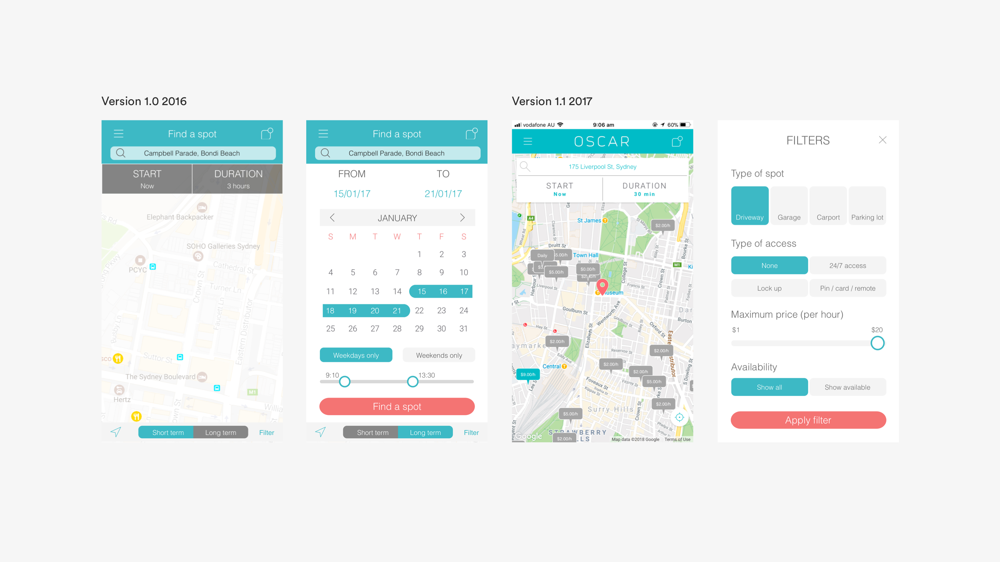

In 2018, I interned at Oscar where I was responsible for undertaking a complete overhaul of the product and create a painless sharing experience.
{: .mt0}

## The Problem
Oscar’s premise is simple—tap a couple buttons to book a parking spot or tap a couple buttons to list your parking spot and start earning. However, as the product and user base began to grow, more features were piled on that generated a myriad of friction points that effectively impeded users from completing their goals.

   
   
The evolution of Oscar. Screenshots taken from the Oscar archives, June 2018.

## The Challenge
Quite simply, our goal was to restore the original premise of Oscar but to also create strong foundation that evolves with user needs. 

The high level goals were to:
1. Make it fast for everyone to use
2. Create a pain-free and positive experience
3. Derive a scalable and unified design system

As a sole UX designer on this effort, I joined a team of 2 developers and a project manager to create a vision for sharing experiences of the future all in under 3 short months.

## Picking up the Pieces
Besides heuristic analysis and initial chats with the team, I had little insight into where—within the product—usability issues were arising from. I began speaking to stakeholders at Oscar to learn about the business and the product goals. These interviews helped in learning about previous research, determining the scope for the project and to better understand the opportunity for the redesign.

## Learning from the Users
With these early insights, I went ahead and conducted a mixture of remote user interviews, surveys, usability testing and cafe studies with a spectrum of expert and new Oscar users. The goals for this initial round of user research were to:
- Understand a users’ day-to-day workflows and pain points
- Learn more about how users interact with the product and the common habits that they have
- Learn more about what users viewed as the ideal sharing experience

To further cement the impact that each feature had on the user when conducting usability testing, I kept the following key questions in mind.

1. What people-problem is this feature trying to solve?
2. What is happening before people get in and start interacting with this screen?
3. What are they feeling and thinking?
4. What got them to this screen in the first place?
5. What happens afterwards?
6. After the interaction with this feature, how do I want users to feel?
7. What do I want users to take away from the experience?

## Opportunities and insights 
### Helping users onboard with ease
The onboarding flow is the first point of contact and impression a user has with the product. The current first impression wasn’t working so well. My research uncovered that the existing product generated around 10% in drop-off rates at every screen in the onboarding process, with the most being attributed to the very first screen. 

The process included a monotonous sequence of input fields, some of which, provided little context of how their purpose would aid in creating a profile.

>“Why do I need to put in my birthday?” — New user I tested the product with.
{: {{site.site-case-quote}}}

What was most alarming, aside from the drop-off rates, was that users often bounced back between Sign Up and Log In buttons, attempting each method until they found the one that would end in success. Coupled with a set of unsupportive error messages that pointed out user mistakes rather than supportive directives to help the user solve the issue, most users would resort to resetting their password in order to access their account, a lengthy process in its own right. 

This debacle resulted in higher error rates, lower conversion rates, increased churn and an overall bumpy entry-point into the app. Users assumed that if it was this difficult to get into the meat of the product, booking/listing their parking spot would be even bigger headache.

### Searching for a Spot
Every time a user entered the app, they were greeted with the search screen. Comprising of a search form and map, the search screen is where the majority of our driver personas spend their time.

Users search for a parking spot through inputting three key pieces of information: their desired parking location, the start time of their booking and the end time of their booking. These three components were displayed as a combination of input bars and time selectors and allowed users to find a suitable parking spot for their needs. It was amazing when it worked.

I first had a hunch of experience issues within the search screen during initial user testing, users spent an abnormally long time to take in this screen despite its visual simplicity. Probing further, I noticed that around 40% experienced issues with search at some point which resulted in costly mistakes such as:
- Booking spots for time periods that users weren’t even looking for. A common behaviour were users booking a spot for the default 1 hour and later extending their booking to the actual time period that they required
- Booking spots at locations they weren’t looking for

These combination of issues led to repeated rapid-clicks, a clear signal of user frustration. This resulted in some users to abandon interaction with the search bar altogether and utilise other methods like navigating through a map manually. 

Analysis of user behaviour over the long term uncovered that almost 80% of our users have at least one location where they repeatedly book. These repeat bookings would occur in the same suburb, street or even the exact same parking spot. We also noticed that our users followed the exact same flow to do this every time. Having to repeatedly follow the exact process was a huge friction point and left them feeling unsupported.

### Listing a Spot
The chief complaint about the listing experience was that it felt like a generic form and lacked and lacked excitement. This resulted in users leaving the listing flow prematurely. Through user interviews, I uncovered the three main reasons for this action:

- A user leaves to gather information they might not have on hand. For example, not all homeowners know what size car their parking spot will fit.
- A user leaves the listing flow to complete another task
- A user has difficulty answering questions and leaves to ask/contact Oscar assistance

Since the product didn’t include a way to still retain inputted information, users rarely returned to complete their listing and a whopping 80% of users never even visited the listing flow after their first attempt.

## Introducing Oscar 2.0
In an age where everything is demanding your time an attention, Oscar gives you your time back by making parking and listing effortless and easy. Oscar understands you and provides you with options that are understandable and actionable.

## How we got there
To jumpstart creativity, I came up with four key design challenges that revolved around the four main issues within the current product:

1. How might we better give users quick access to their account?
2. How might we better adapt the search screen to minimise booking errors?
3. How can we support repeat user actions?
4. How might we support users to list with ease?

## Giving users quick access to their account
The major reason why users experienced problematic entry to the app was that they simply didn’t know that they had an account. 

>“It’d be nice if I was told I have an account before I fill out the rest of the form” — a user I tested the product with.
{: {{site.site-case-quote}}}

Based on this insight, I realised that simply modifying the error messages to be clearer and more supportive wasn’t going to solve the issue or create a calm experience. So instead of placing the responsibility of the user to recall that they have an account, know their email and their password, I began experimenting with an an alternate flow that offloaded the responsibility to Oscar.

The new proposed onbording flow worked by removing concrete decisions between Sign Up and Login and requires the user upfront for an easily recallable piece of information: a mobile number. Central to this feature, were these key ideas:
1. Stop relying on user recall. Do the heavy lifting for them.
2. Establish the feeling of support as early as early as possible.
3. Ask as little questions as possible. Get users sharing as soon as you can.

After the mobile number is provided, the product would then intelligently determine if this information exists in its database and then discreetly deliver the remaining flow custom to the user’s circumstance. 

To get new users up and going as soon as possible and creating a lower barrier to entry, I experimented with delaying additional information that the user would need to input (such as vehicle registration and account verification) until deeper in the user journey, such as booking or listing a spot. Once a user has found a spot that they’d like to book or list, spending an extra minute to confirm details is as much of a friction point.

Fearing that the fundamentally new onboarding flow would cause friction of its own, I began testing early stages of the designs as soon as possible. To my surprise, not a single participant had trouble with the sequencing of the new flow and the design resonated well with participants.

## Minimising booking errors
A culprit of many headaches, the search screen resulted in many users incorrectly booking a parking spot. 

My first hypothesis on why this screen was causing so many issues was that the search bar appeared “optional”. With so much emphasis on the map, user attention was skewed towards it.

Early explorations of the new search screen played around with depth and scale.

The new search screen features a search bar floating on top of the map, creating a greater understanding of its function and importance. Whilst the map still takes up a majority of the screen real estate, it’s no longer the big star of the interface.

Introducing a default valid approach to the search bar and time selectors further reduces mental friction and speaks to the user, “you don’t need to do anything, but feel free to customise the search to better suit your needs”.

To further accelerate bookings and cater for the 80% of users that make repeat bookings, I designed an accelerators feature that gives users quick access to their most likely destinations. 

Accelerators work by intelligently remembering how often a user visits a location and prompt the user to add the location to a list of saved places, asking simply for the name of the saved place.

## Listing
I hypothesised that breaking the listing flow into digestible chunks would result in increased excitement and further understanding of each section. 

Contextually chunking sections of the listing flow

Because our user behaviours exist on a spectrum of hands-off and complete control, it was essential to create design patterns that catered for these two behaviours. This meant the UI needed to inspire confidence for the majority but those who wanted to assert control, needed to know how to discover the feature. 

## The Results
The redesign of the Oscar app on iOS and Android has had a positive impact on both the driver and spot owner experience, at the time of writing this (3 months since launch). 

- User activation increased by 500%
- Booking error rates decreased by 30%
- Booking time decreased by 20%

**For confidentiality reasons I have omitted the actual values for these metrics*. 

## What I learned
Looking back at the initial scribbles and sketches I made in my notebook during initial brainstorming sessions, I’m highly surprised at the amount of progress I was able to make.

Choosing my first internship to be at a startup was a decision that I strongly stand by. I could never have imagined being pushed so hard, learning so much (cool things outside my bubble of design and tech!) and having a tonne of fun, all in just 3 short months. 

I personally learned so much throughout the course of the project, especially the importance of being curious and continually reaching out to different types of people for feedback and criticism. Each person plays an essential role and has a plethora of knowledge to offer.

I can gladly say that I’ve walked away from my time at Oscar more challenged and ambitious than ever before but also happier than I could’ve imagined having been able to learn from this experience and evolve as a designer, creator and maker.

### Key takeaways
- Get over the feeling of making mistakes and being wrong. Learning from mistakes is the fastest and most effective way to grow as a designer.
- It’s important to give users choice but its also important to understand when choice is a barrier. 
- Make informed design decisions. Designers intuition is good starting point but it shouldn’t be the only reason for a design choice.

