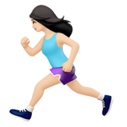
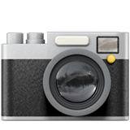
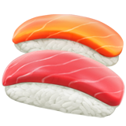
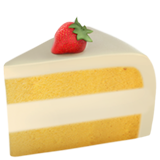

<section class="mt-4 mt-lg-6 w-80-s" markdown="1">
   <h1 class="type-big">Hi! I'm <a href="about">Zainab Alasadi</a> — a UX designer with a background in computer science, currently scaling design systems at <a href="https://www.macquarie.com/au/personal" target="_blank">Macquarie Group</a>.</h1>

   <h1 class="type-big">I’ve previously interned at <a href="https://www.sharewithoscar.com" target="_blank">Oscar</a>, led design at <a href="https://www.180dc.org" target="_blank">180DC</a> and studied at <a href="https://www.unsw.edu.au" target="_blank">UNSW</a>. Lover of , , ,  and . Avid supporter of the <a href="https://www.theatlantic.com/entertainment/archive/2012/10/singular-beauty-em-dash/322196/" target="_blank">em dash</a> and lifelong investor in . I love to take <a href="https://www.instagram.com/p/B0Dj45ZHetV/?utm_source=ig_web_button_share_sheet" target="_blank">pictures of spaces</a> and <a href="https://medium.com/@zainabalasadi" target="_blank">read about design</a>. I spend my free time admiring <a href="https://fontsinuse.com/" target="_blank">pretty fonts</a>, exploring the coasts of Sydney and stressing out over a <a href="https://www.instagram.com/stories/highlights/18054971740097220/?hl=en" target="_blank">missing semicolon</a>.</h1>
</section>